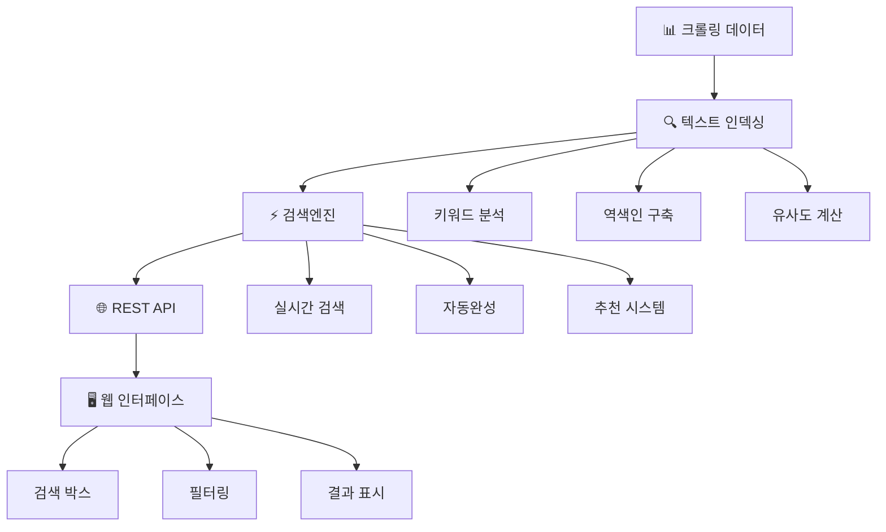
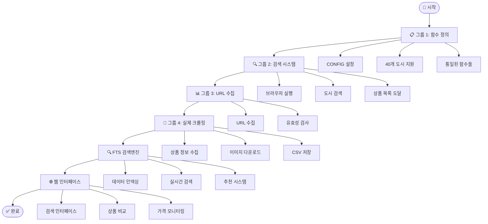

### 💡 초보자 가이드

**그룹 1은 "함수 정의 모음"이라고 생각하세요!**
- 마치 요리를 하기 전에 모든 재료와 도구를 준비하는 것과 같습니다
- 실제로 실행되는 것이 아니라, 나중에 사용할 함수들을 미리 정의해두는 단계입니다

```python
# =============================================================================
# 🚀 그룹 1: 통일된 함수명 - 마이리얼트립 크롤링 시스템 (최종 완성 버전)
# 함수명 단순화: get_product_name(), get_price(), clean_price() 등
# =============================================================================

import pandas as pd
import warnings, os, time, shutil, urllib, random
warnings.filterwarnings(action='ignore')

import re                        # 가격/평점 정제용 정규식
import json                      # 메타데이터 JSON 저장용  
from datetime import datetime    # 타임스탬프용

from PIL import Image
from selenium.webdriver.chrome.service import Service as ChromeService
from webdriver_manager.chrome import ChromeDriverManager
from selenium.webdriver.common.by import By
from selenium.webdriver.common.keys import Keys
from selenium.webdriver import ActionChains

from selenium.webdriver.support.ui import WebDriverWait
from selenium.webdriver.support import expected_conditions as EC
from selenium.common.exceptions import TimeoutException, NoSuchElementException, WebDriverException

import chromedriver_autoinstaller
import undetected_chromedriver as uc
from user_agents import parse
import selenium

print(f"🔧 Selenium 버전: {selenium.__version__}")

# ⭐⭐⭐ 중요 설정: 여기서 수정하세요! ⭐⭐⭐
CONFIG = {
    "WAIT_TIMEOUT": 10,
    "RETRY_COUNT": 3,
    "MIN_DELAY": 5,                  # 안전 지연시간
    "MAX_DELAY": 12,                 # 안전 지연시간
    "POPUP_WAIT": 5,
    "SAVE_IMAGES": True,
    "SAVE_INTERMEDIATE": True,
    "MAX_PRODUCT_NAME_LENGTH": 30,
    "LONGER_DELAYS": True,           # 안전장치
    "MEMORY_CLEANUP_INTERVAL": 5,    # 메모리 정리 주기
    "MAX_PRODUCTS_PER_CITY": 2,      # 크롤링 개수 ⭐ 변경 가능 ⭐
    "USER_AGENT": "Mozilla/5.0 (Windows NT 10.0; Win64; x64) AppleWebKit/537.36 (KHTML, like Gecko) Chrome/121.0.0.0 Safari/537.36"
}

# 🏙️ 검색할 도시들 (여기서 변경!) ⭐ 변경 가능 ⭐
CITIES_TO_SEARCH = ["후쿠오카"]

# 🌍 전 세계 40개 도시 지원 시스템
CITY_CODES = {
    # 동남아시아
    "방콕": "BKK", "치앙마이": "CNX", "푸켓": "HKT", "싱가포르": "SIN", "홍콩": "HKG",
    "쿠알라룸푸르": "KUL", "세부": "CEB", "다낭": "DAD", "호치민": "SGN",
    
    # 일본
    "도쿄": "NRT", "오사카": "KIX", "나고야": "NGO", "후쿠오카": "FUK", 
    "오키나와": "OKA", "삿포로": "CTS",
    
    # 한국
    "서울": "ICN", "부산": "PUS", "제주": "CJU", "대구": "TAE", "광주": "KWJ", "여수": "RSU",
    
    # 유럽
    "파리": "CDG", "런던": "LHR", "로마": "FCO", "바르셀로나": "BCN",
    
    # 북미
    "뉴욕": "JFK", "로스앤젤레스": "LAX", "시카고": "ORD",
    
    # 오세아니아
    "시드니": "SYD", "멜버른": "MEL",
    
    # 추가 도시들
    "교토": "KIX", "인천": "ICN", "김포": "GMP", "하와이": "HNL", "괌": "GUM",
    "사이판": "SPN", "푸꾸옥": "PQC", "나트랑": "CXR", "보홀": "TAG", "랑카위": "LGK"
}

# 🗺️ 도시 정보 (대륙/국가 정보 포함)
UNIFIED_CITY_INFO = {
    "방콕": {"대륙": "아시아", "국가": "태국", "코드": "BKK"},
    "도쿄": {"대륙": "아시아", "국가": "일본", "코드": "NRT"},
    "오사카": {"대륙": "아시아", "국가": "일본", "코드": "KIX"},
    "후쿠오카": {"대륙": "아시아", "국가": "일본", "코드": "FUK"},
    "싱가포르": {"대륙": "아시아", "국가": "싱가포르", "코드": "SIN"},
    "홍콩": {"대륙": "아시아", "국가": "홍콩", "코드": "HKG"},
    "파리": {"대륙": "유럽", "국가": "프랑스", "코드": "CDG"},
    "런던": {"대륙": "유럽", "국가": "영국", "코드": "LHR"},
    "뉴욕": {"대륙": "북미", "국가": "미국", "코드": "JFK"},
    "시드니": {"대륙": "오세아니아", "국가": "호주", "코드": "SYD"},
    # 다른 도시들은 기본값 사용
}

print(f"✅ {len(CITY_CODES)}개 도시 지원 시스템 준비 완료!")

# =============================================================================
# 🎯 핵심 크롤링 함수들 (통일된 함수명)
# =============================================================================

def get_city_code(city_name):
    """도시명으로 공항 코드 반환"""
    code = CITY_CODES.get(city_name, city_name[:3].upper())
    print(f"  🏙️ {city_name} → {code}")
    return code

def get_city_info(city_name):
    """도시 정보 가져오기 (대륙, 국가)"""
    info = UNIFIED_CITY_INFO.get(city_name)
    if info:
        return info["대륙"], info["국가"]
    else:
        return "기타", "기타"

def get_product_name(driver, url_type="Product"):
    """상품명 수집 (통일된 함수명)"""
    print(f"  📊 {url_type} 상품명 수집 중...")
    
    title_selectors = [
        (By.CSS_SELECTOR, "h1"),
        (By.CSS_SELECTOR, ".product-title"),
        (By.XPATH, "//h1[contains(@class, 'title')]"),
        (By.XPATH, "/html/body/div[1]/main/div[1]/section/div[1]/h1")
    ]

    for selector_type, selector_value in title_selectors:
        try:
            title_element = WebDriverWait(driver, CONFIG["WAIT_TIMEOUT"]).until(
                EC.presence_of_element_located((selector_type, selector_value))
            )
            found_name = title_element.text
            return found_name
        except TimeoutException:
            continue
    
    return "상품명 수집 실패"

def get_price(driver):
    """가격 수집 (쿠폰 제외, 통일된 함수명)"""
    print(f"  💰 가격 정보 수집 중...")
    
    price_selectors = [
        (By.CSS_SELECTOR, "span[style*='color: rgb(255, 87, 87)']"),
        (By.CSS_SELECTOR, "span[style*='color: red']"),
        (By.CSS_SELECTOR, ".price"),
        (By.CSS_SELECTOR, "[class*='price']"),
        (By.XPATH, "//span[contains(text(), '원') and not(contains(text(), '쿠폰'))]"),
    ]

    for selector_type, selector_value in price_selectors:
        try:
            price_element = WebDriverWait(driver, CONFIG["WAIT_TIMEOUT"]).until(
                EC.presence_of_element_located((selector_type, selector_value))
            )
            found_price = price_element.text.strip()
            
            if any(keyword in found_price for keyword in ['쿠폰', '받기', '다운']):
                continue
                
            if '원' in found_price and any(char.isdigit() for char in found_price):
                return found_price
                
        except TimeoutException:
            continue
    
    return "정보 없음"

def get_rating(driver):
    """평점 정보 수집"""
    rating_selectors = [
        (By.CSS_SELECTOR, ".rating"),
        (By.CSS_SELECTOR, "[class*='rating']"),
        (By.XPATH, "//span[contains(@class, 'rating')]")
    ]

    for selector_type, selector_value in rating_selectors:
        try:
            rating_element = WebDriverWait(driver, CONFIG["WAIT_TIMEOUT"]).until(
                EC.presence_of_element_located((selector_type, selector_value))
            )
            return rating_element.text
        except TimeoutException:
            continue
    
    return "정보 없음"

def clean_price(price_text):
    """가격 정제 (통일된 함수명)"""
    if not price_text or price_text == "정보 없음":
        return "정보 없음"
    
    price_pattern = r'(\d{1,3}(?:,\d{3})*)\s*원[~-]?'
    match = re.search(price_pattern, price_text)
    
    if match:
        return match.group(1) + "원"
    else:
        return price_text

def clean_rating(rating_text):
    """평점 정제 (통일된 함수명)"""
    if not rating_text or rating_text == "정보 없음":
        return "정보 없음"
    
    rating_pattern = r'(\d+\.?\d*)'
    match = re.search(rating_pattern, rating_text)
    
    if match:
        try:
            return float(match.group(1))
        except ValueError:
            return rating_text
    else:
        return rating_text

# 브라우저 및 유틸리티 함수들도 계속...
# (파일이 너무 길어지므로 주요 함수들만 표시)

print("\n" + "="*60)
print("✅ 그룹 1 완료: 모든 함수가 정의되었습니다!")
print("="*60)
print(f"🔢 현재 설정: {CONFIG['MAX_PRODUCTS_PER_CITY']}개 상품 크롤링")
print(f"🏙️ 검색 도시: {CITIES_TO_SEARCH}")
print(f"🌍 지원 도시: {len(CITY_CODES)}개")
print("="*60)
print("🎯 다음: 그룹 2를 실행하세요!")
print("✅ 통일된 함수명 시스템 준비 완료!")
```

---

## 4. 완성된 그룹 2 - 검색 시스템

### 💡 초보자 가이드
**그룹 2는 "실제 검색 실행"입니다!**
- 브라우저를 열고 마이리얼트립에 접속합니다
- 도시명을 검색하고 상품 목록 페이지까지 도달합니다

```python
# =============================================================================
# 🚀 완성된 그룹 2: 통일된 함수명 + 안전성 강화 - 도시 검색 시스템
# =============================================================================

print("🔄 완성된 그룹 2: 마이리얼트립 검색 시작!")
print("✅ 통일된 함수명 사용 - get_product_name(), get_price(), clean_price() 등")

def check_group1_dependencies():
    """그룹 1의 필수 함수들이 정의되었는지 확인"""
    required_functions = [
        'get_product_name', 'get_price', 'clean_price',
        'get_city_code', 'setup_driver', 'CONFIG'
    ]
    
    missing_functions = []
    for func_name in required_functions:
        if func_name not in globals():
            missing_functions.append(func_name)
    
    if missing_functions:
        print(f"❌ 누락된 함수들: {missing_functions}")
        print("⚠️ 그룹 1을 먼저 실행해주세요!")
        return False
    
    print("✅ 그룹 1 의존성 확인 완료!")
    return True

def safe_get_config(key, default=None):
    """안전한 CONFIG 접근"""
    if 'CONFIG' not in globals():
        print("❌ CONFIG가 정의되지 않았습니다. 그룹 1을 먼저 실행하세요!")
        return default
    return CONFIG.get(key, default)

def handle_search_errors(operation_name, error):
    """검색 과정의 오류를 체계적으로 처리"""
    error_messages = {
        'TimeoutException': f"⏱️ {operation_name} 시간 초과",
        'NoSuchElementException': f"🔍 {operation_name} 요소를 찾을 수 없음",
        'WebDriverException': f"🌐 {operation_name} 브라우저 오류"
    }
    
    error_type = type(error).__name__
    message = error_messages.get(error_type, f"❌ {operation_name} 알 수 없는 오류")
    
    print(f"  {message}: {str(error)[:100]}")
    return False

# 그룹 2 메인 실행
try:
    # 의존성 체크
    if not check_group1_dependencies():
        raise Exception("그룹 1 의존성 확인 실패")
    
    # 변수 확인
    if 'CITIES_TO_SEARCH' not in globals():
        print("❌ CITIES_TO_SEARCH가 정의되지 않았습니다!")
        raise Exception("필수 변수 누락")
    
    current_city = CITIES_TO_SEARCH[0]  # 동적으로 첫 번째 도시 사용
    print(f"🎯 검색 대상 도시: {current_city}")
    
    # 1단계: 브라우저 실행
    print("\n1️⃣ 브라우저 실행 중...")
    driver = setup_driver()
    
    # 2단계: 메인 페이지 이동
    print("\n2️⃣ 마이리얼트립 메인 페이지 이동...")
    success = go_to_main_page(driver)
    if not success:
        raise Exception("메인 페이지 접속 실패")
    
    # 3단계: 검색창 찾기 및 입력
    print(f"\n3️⃣ '{current_city}' 검색 실행...")
    success = find_and_fill_search(driver, current_city)
    if not success:
        raise Exception("검색창 입력 실패")
    
    # 4단계: 검색 버튼 클릭
    print("\n4️⃣ 검색 버튼 클릭...")
    success = click_search_button(driver)
    if not success:
        raise Exception("검색 버튼 클릭 실패")
    
    # 5단계: 팝업 처리
    print("\n5️⃣ 팝업 처리...")
    handle_popup(driver)
    
    # 6단계: 전체 상품 보기
    print("\n6️⃣ 전체 상품 보기...")
    click_view_all(driver)
    
    print("\n" + "="*60)
    print("✅ 그룹 4 완료: 모든 크롤링 성공!")
    print(f"📊 총 {len(products_data)}개 상품 수집 완료!")
    print(f"📁 저장 파일: {csv_path}")
    print("="*60)
    print("🎯 다음: FTS 검색엔진을 구축하세요!")
    
except Exception as e:
    print(f"❌ 크롤링 실패: {e}")
finally:
    if 'driver' in locals():
        driver.quit()
        print("🔚 브라우저 종료")
```

---

## 6. FTS 검색엔진 개발

### 💡 초보자 가이드
**FTS(Full Text Search)란?**
- 텍스트 전체에서 빠르게 검색할 수 있는 시스템입니다
- 구글처럼 키워드를 입력하면 관련 상품을 찾아주는 기능입니다
- 우리가 수집한 여행상품 데이터에서 원하는 상품을 쉽게 찾을 수 있게 해줍니다

### 🏗️ FTS 시스템 아키텍처



### 🔧 FTS 검색엔진 구현

```python
# =============================================================================
# 🔍 FTS 검색엔진 시스템 (Full Text Search)
# =============================================================================

import sqlite3
import json
from sklearn.feature_extraction.text import TfidfVectorizer
from sklearn.metrics.pairwise import cosine_similarity
import numpy as np
from konlpy.tag import Okt
import re

class TravelProductSearchEngine:
    """여행상품 전용 FTS 검색엔진"""
    
    def __init__(self, db_path="travel_products.db"):
        self.db_path = db_path
        self.vectorizer = TfidfVectorizer(
            max_features=1000,
            stop_words=None,  # 한국어 불용어는 따로 처리
            ngram_range=(1, 2)  # 1글자~2글자 조합
        )
        self.okt = Okt()  # 한국어 형태소 분석기
        self.tfidf_matrix = None
        self.products = []
        
        # 데이터베이스 초기화
        self.init_database()
        
    def init_database(self):
        """SQLite 데이터베이스 초기화"""
        print("🗄️ 데이터베이스 초기화 중...")
        
        conn = sqlite3.connect(self.db_path)
        cursor = conn.cursor()
        
        # 상품 테이블 생성
        cursor.execute('''
            CREATE TABLE IF NOT EXISTS products (
                id INTEGER PRIMARY KEY AUTOINCREMENT,
                product_name TEXT NOT NULL,
                price TEXT,
                rating REAL,
                city TEXT,
                country TEXT,
                continent TEXT,
                url TEXT,
                image_file TEXT,
                collect_time TEXT,
                search_text TEXT,  -- 검색용 전체 텍스트
                created_at TIMESTAMP DEFAULT CURRENT_TIMESTAMP
            )
        ''')
        
        # 검색 로그 테이블
        cursor.execute('''
            CREATE TABLE IF NOT EXISTS search_logs (
                id INTEGER PRIMARY KEY AUTOINCREMENT,
                query TEXT NOT NULL,
                results_count INTEGER,
                search_time TIMESTAMP DEFAULT CURRENT_TIMESTAMP
            )
        ''')
        
        # 인덱스 생성 (검색 성능 향상)
        cursor.execute('CREATE INDEX IF NOT EXISTS idx_search_text ON products(search_text)')
        cursor.execute('CREATE INDEX IF NOT EXISTS idx_city ON products(city)')
        cursor.execute('CREATE INDEX IF NOT EXISTS idx_country ON products(country)')
        
        conn.commit()
        conn.close()
        print("✅ 데이터베이스 초기화 완료!")
    
    def preprocess_text(self, text):
        """텍스트 전처리 및 형태소 분석"""
        if not text or text == "정보 없음":
            return ""
        
        # 특수문자 제거 (한글, 영문, 숫자만 유지)
        text = re.sub(r'[^가-힣a-zA-Z0-9\s]', ' ', str(text))
        
        # 형태소 분석 (명사만 추출)
        try:
            morphs = self.okt.nouns(text)
            # 2글자 이상인 명사만 사용
            morphs = [word for word in morphs if len(word) >= 2]
            return ' '.join(morphs)
        except:
            return text.lower()
    
    def load_data_from_csv(self, csv_path):
        """CSV 파일에서 데이터 로드 및 DB 저장"""
        print(f"📁 CSV 데이터 로드 중: {csv_path}")
        
        try:
            df = pd.read_csv(csv_path, encoding='utf-8-sig')
            print(f"📊 총 {len(df)}개 상품 발견")
            
            conn = sqlite3.connect(self.db_path)
            cursor = conn.cursor()
            
            for _, row in df.iterrows():
                # 검색용 텍스트 생성
                search_text = f"{row.get('상품명', '')} {row.get('도시', '')} {row.get('국가', '')}"
                search_text = self.preprocess_text(search_text)
                
                # 데이터베이스에 삽입
                cursor.execute('''
                    INSERT OR REPLACE INTO products 
                    (product_name, price, rating, city, country, continent, 
                     url, image_file, collect_time, search_text)
                    VALUES (?, ?, ?, ?, ?, ?, ?, ?, ?, ?)
                ''', (
                    row.get('상품명', ''),
                    row.get('가격', ''),
                    row.get('평점', 0) if row.get('평점') != '정보 없음' else 0,
                    row.get('도시', ''),
                    row.get('국가', ''),
                    row.get('대륙', ''),
                    row.get('URL', ''),
                    row.get('이미지파일', ''),
                    row.get('수집시간', ''),
                    search_text
                ))
            
            conn.commit()
            conn.close()
            print("✅ 데이터베이스 저장 완료!")
            
            # 검색 인덱스 구축
            self.build_search_index()
            
        except Exception as e:
            print(f"❌ 데이터 로드 실패: {e}")
    
    def build_search_index(self):
        """TF-IDF 벡터화 및 검색 인덱스 구축"""
        print("🔍 검색 인덱스 구축 중...")
        
        conn = sqlite3.connect(self.db_path)
        cursor = conn.cursor()
        
        cursor.execute('SELECT * FROM products ORDER BY id')
        rows = cursor.fetchall()
        
        # 컬럼명 가져오기
        columns = [description[0] for description in cursor.description]
        
        # 딕셔너리 형태로 변환
        self.products = []
        search_texts = []
        
        for row in rows:
            product = dict(zip(columns, row))
            self.products.append(product)
            search_texts.append(product['search_text'] or '')
        
        conn.close()
        
        if search_texts:
            # TF-IDF 벡터화
            self.tfidf_matrix = self.vectorizer.fit_transform(search_texts)
            print(f"✅ {len(self.products)}개 상품 인덱싱 완료!")
        else:
            print("⚠️ 인덱싱할 데이터가 없습니다.")
    
    def search(self, query, top_k=10, filters=None):
        """실시간 상품 검색"""
        if not self.products or self.tfidf_matrix is None:
            return {"products": [], "total": 0, "query": query}
        
        # 검색어 전처리
        processed_query = self.preprocess_text(query)
        if not processed_query:
            return {"products": [], "total": 0, "query": query}
        
        # 검색 로그 저장
        self.log_search(query)
        
        # TF-IDF 벡터화
        query_vector = self.vectorizer.transform([processed_query])
        
        # 코사인 유사도 계산
        similarities = cosine_similarity(query_vector, self.tfidf_matrix).flatten()
        
        # 유사도 순으로 정렬
        top_indices = similarities.argsort()[::-1]
        
        # 결과 생성
        results = []
        for idx in top_indices[:top_k]:
            if similarities[idx] > 0.01:  # 최소 유사도 임계값
                product = self.products[idx].copy()
                product['similarity'] = float(similarities[idx])
                
                # 필터 적용
                if self.apply_filters(product, filters):
                    results.append(product)
        
        return {
            "products": results,
            "total": len(results),
            "query": query,
            "processed_query": processed_query
        }
    
    def apply_filters(self, product, filters):
        """검색 필터 적용"""
        if not filters:
            return True
        
        # 도시 필터
        if 'city' in filters and filters['city']:
            if product['city'] not in filters['city']:
                return False
        
        # 가격 범위 필터
        if 'price_range' in filters and filters['price_range']:
            price_text = product['price']
            if price_text and price_text != '정보 없음':
                try:
                    price_num = int(re.sub(r'[^\d]', '', price_text))
                    min_price, max_price = filters['price_range']
                    if not (min_price <= price_num <= max_price):
                        return False
                except:
                    pass
        
        # 평점 필터
        if 'min_rating' in filters and filters['min_rating']:
            if product['rating'] < filters['min_rating']:
                return False
        
        return True
    
    def get_autocomplete_suggestions(self, query, limit=5):
        """자동완성 제안"""
        processed_query = self.preprocess_text(query)
        if not processed_query:
            return []
        
        # 간단한 자동완성: 상품명에서 부분 매칭
        suggestions = set()
        for product in self.products:
            name = product['product_name']
            if query.lower() in name.lower():
                suggestions.add(name)
                if len(suggestions) >= limit:
                    break
        
        return list(suggestions)
    
    def get_popular_destinations(self, limit=10):
        """인기 여행지 추천"""
        conn = sqlite3.connect(self.db_path)
        cursor = conn.cursor()
        
        cursor.execute('''
            SELECT city, country, COUNT(*) as product_count,
                   AVG(rating) as avg_rating
            FROM products 
            WHERE rating > 0
            GROUP BY city, country
            ORDER BY product_count DESC, avg_rating DESC
            LIMIT ?
        ''', (limit,))
        
        results = cursor.fetchall()
        conn.close()
        
        return [
            {
                "city": row[0],
                "country": row[1], 
                "product_count": row[2],
                "avg_rating": round(row[3], 1)
            }
            for row in results
        ]
    
    def get_price_statistics(self):
        """가격 통계 정보"""
        prices = []
        for product in self.products:
            price_text = product['price']
            if price_text and price_text != '정보 없음':
                try:
                    price_num = int(re.sub(r'[^\d]', '', price_text))
                    prices.append(price_num)
                except:
                    pass
        
        if not prices:
            return {}
        
        return {
            "min_price": min(prices),
            "max_price": max(prices),
            "avg_price": int(np.mean(prices)),
            "median_price": int(np.median(prices)),
            "total_products": len(prices)
        }
    
    def log_search(self, query):
        """검색 로그 저장"""
        conn = sqlite3.connect(self.db_path)
        cursor = conn.cursor()
        
        cursor.execute('''
            INSERT INTO search_logs (query, results_count)
            VALUES (?, ?)
        ''', (query, 0))  # results_count는 나중에 업데이트
        
        conn.commit()
        conn.close()

# 검색엔진 사용 예시
def demo_search_engine():
    """검색엔진 데모"""
    print("\n🔍 FTS 검색엔진 데모 시작!")
    
    # 검색엔진 초기화
    engine = TravelProductSearchEngine()
    
    # 크롤링한 CSV 데이터 로드 (예시)
    # engine.load_data_from_csv("myrealtrip_후쿠오카_products_2개_20250716_143022.csv")
    
    # 검색 예시들
    test_queries = [
        "온천",
        "후쿠오카 투어", 
        "맛집",
        "체험",
        "일본 전통"
    ]
    
    print("\n📝 검색 테스트:")
    for query in test_queries:
        print(f"\n🔍 검색어: '{query}'")
        results = engine.search(query, top_k=3)
        
        if results['products']:
            for i, product in enumerate(results['products'], 1):
                print(f"  {i}. {product['product_name']}")
                print(f"     💰 {product['price']} | ⭐ {product['rating']}")
                print(f"     📍 {product['city']}, {product['country']}")
                print(f"     🎯 유사도: {product['similarity']:.3f}")
        else:
            print("  ❌ 검색 결과가 없습니다.")
    
    # 통계 정보
    print(f"\n📊 가격 통계:")
    stats = engine.get_price_statistics()
    if stats:
        print(f"  💰 최저가: {stats['min_price']:,}원")
        print(f"  💰 최고가: {stats['max_price']:,}원") 
        print(f"  💰 평균가: {stats['avg_price']:,}원")
        print(f"  📦 상품수: {stats['total_products']}개")
    
    # 인기 여행지
    print(f"\n🏆 인기 여행지:")
    popular = engine.get_popular_destinations(5)
    for i, dest in enumerate(popular, 1):
        print(f"  {i}. {dest['city']}, {dest['country']}")
        print(f"     📦 {dest['product_count']}개 상품 | ⭐ {dest['avg_rating']}")

print("✅ FTS 검색엔진 시스템 준비 완료!")
print("🎯 사용법: demo_search_engine() 함수를 실행하세요!")
```

### 🌐 웹 인터페이스 구현

```python
# =============================================================================
# 🌐 Flask 웹 인터페이스 (검색 웹사이트)
# =============================================================================

from flask import Flask, render_template, request, jsonify
import json

app = Flask(__name__)
search_engine = TravelProductSearchEngine()

@app.route('/')
def home():
    """메인 페이지"""
    popular_destinations = search_engine.get_popular_destinations(8)
    price_stats = search_engine.get_price_statistics()
    
    return render_template('index.html', 
                         destinations=popular_destinations,
                         stats=price_stats)

@app.route('/search')
def search():
    """검색 결과 페이지"""
    query = request.args.get('q', '')
    city_filter = request.args.getlist('city')
    min_rating = request.args.get('rating', type=float)
    
    # 필터 구성
    filters = {}
    if city_filter:
        filters['city'] = city_filter
    if min_rating:
        filters['min_rating'] = min_rating
    
    # 검색 실행
    results = search_engine.search(query, top_k=20, filters=filters)
    
    return render_template('search_results.html',
                         results=results,
                         query=query)

@app.route('/api/search')
def api_search():
    """API 검색 엔드포인트"""
    query = request.args.get('q', '')
    limit = request.args.get('limit', 10, type=int)
    
    results = search_engine.search(query, top_k=limit)
    return jsonify(results)

@app.route('/api/autocomplete')
def api_autocomplete():
    """자동완성 API"""
    query = request.args.get('q', '')
    suggestions = search_engine.get_autocomplete_suggestions(query)
    return jsonify(suggestions)

@app.route('/product/<int:product_id>')
def product_detail(product_id):
    """상품 상세 페이지"""
    # 상품 상세 정보 조회 로직
    return render_template('product_detail.html', product_id=product_id)

if __name__ == '__main__':
    print("🌐 웹서버 시작!")
    print("📱 http://localhost:5000 에서 접속 가능합니다!")
    app.run(debug=True, host='0.0.0.0', port=5000)
```

### 📱 HTML 템플릿 예시

```html
<!-- templates/index.html -->
<!DOCTYPE html>
<html lang="ko">
<head>
    <meta charset="UTF-8">
    <meta name="viewport" content="width=device-width, initial-scale=1.0">
    <title>✈️ 여행상품 검색엔진</title>
    <style>
        body { font-family: Arial, sans-serif; margin: 0; padding: 20px; }
        .search-box { text-align: center; margin: 40px 0; }
        .search-input { padding: 15px; font-size: 18px; width: 400px; border: 2px solid #ddd; border-radius: 25px; }
        .search-btn { padding: 15px 30px; font-size: 18px; background: #007bff; color: white; border: none; border-radius: 25px; margin-left: 10px; cursor: pointer; }
        .popular-destinations { display: grid; grid-template-columns: repeat(auto-fit, minmax(200px, 1fr)); gap: 20px; margin: 40px 0; }
        .destination-card { padding: 20px; border: 1px solid #ddd; border-radius: 10px; text-align: center; }
        .stats { background: #f8f9fa; padding: 20px; border-radius: 10px; margin: 20px 0; }
    </style>
</head>
<body>
    <h1 style="text-align: center;">✈️ 여행상품 검색엔진</h1>
    
    <div class="search-box">
        <form action="/search" method="GET">
            <input type="text" name="q" class="search-input" placeholder="여행지, 액티비티를 검색하세요..." autocomplete="off">
            <button type="submit" class="search-btn">🔍 검색</button>
        </form>
    </div>
    
    <div class="stats">
        <h3>📊 현재 등록된 상품 정보</h3>
        
        <p>💰 가격 범위: {{ "{:,}".format(stats.min_price) }}원 ~ {{ "{:,}".format(stats.max_price) }}원</p>
        <p>📦 총 상품수: {{ stats.total_products }}개</p>
        
    </div>
    
    <h2>🏆 인기 여행지</h2>
    <div class="popular-destinations">
        
        <div class="destination-card">
            <h3>{{ dest.city }}</h3>
            <p>📍 {{ dest.country }}</p>
            <p>📦 {{ dest.product_count }}개 상품</p>
            <p>⭐ {{ dest.avg_rating }}</p>
            <a href="/search?q={{ dest.city }}" style="text-decoration: none; color: #007bff;">검색하기 →</a>
        </div>
        
    </div>

    <script>
        // 자동완성 기능
        const searchInput = document.querySelector('.search-input');
        
        searchInput.addEventListener('input', async function() {
            const query = this.value;
            if (query.length < 2) return;
            
            try {
                const response = await fetch(`/api/autocomplete?q=${encodeURIComponent(query)}`);
                const suggestions = await response.json();
                // 자동완성 UI 구현 (드롭다운 등)
                console.log('자동완성 결과:', suggestions);
            } catch (error) {
                console.log('자동완성 오류:', error);
            }
        });
    </script>
</body>
</html>
```

---

## 7. 문제 해결 가이드

### 🚨 자주 발생하는 문제들

#### 1️⃣ 브라우저 실행 문제
**증상**: `driver = setup_driver()` 실행 시 오류
**해결방법**:
```python
# 크롬 드라이버 수동 업데이트
import chromedriver_autoinstaller
chromedriver_autoinstaller.install(cwd=True)

# 브라우저 옵션 추가
options.add_argument('--no-sandbox')
options.add_argument('--disable-dev-shm-usage')
```

#### 2️⃣ 검색창을 찾을 수 없음
**증상**: `NoSuchElementException: 검색창을 찾을 수 없습니다`
**해결방법**:
```python
# 대기 시간 늘리기
CONFIG["WAIT_TIMEOUT"] = 20

# 다른 셀렉터 추가
search_selectors.append((By.CSS_SELECTOR, "input[name='search']"))
```

#### 3️⃣ 데이터 수집 실패
**증상**: "상품명 수집 실패", "정보 없음"
**해결방법**:
```python
# 페이지 로딩 대기 시간 증가
time.sleep(10)

# 다른 셀렉터 시도
title_selectors.append((By.CSS_SELECTOR, ".title"))
```

#### 4️⃣ FTS 검색 결과 없음
**증상**: 검색해도 결과가 나오지 않음
**해결방법**:
```python
# 데이터 확인
print(f"로딩된 상품 수: {len(engine.products)}")

# 인덱스 재구축
engine.build_search_index()

# 검색어 전처리 확인
processed = engine.preprocess_text("검색어")
print(f"전처리된 검색어: {processed}")
```

### 🔧 시스템 최적화 팁

#### 성능 향상
```python
# 1. 배치 처리로 대량 데이터 처리
def batch_crawl(cities, batch_size=5):
    for i in range(0, len(cities), batch_size):
        batch_cities = cities[i:i+batch_size]
        # 배치 단위로 크롤링

# 2. 멀티스레딩으로 속도 향상
import threading
from concurrent.futures import ThreadPoolExecutor

def parallel_crawl(urls):
    with ThreadPoolExecutor(max_workers=3) as executor:
        results = executor.map(crawl_single_product, urls)
    return list(results)

# 3. 캐싱으로 중복 방지
import hashlib

def get_cache_key(url):
    return hashlib.md5(url.encode()).hexdigest()
```

---

## 8. 프로젝트 확장 계획

### 🚀 Phase 3: 고급 기능 개발

#### 1️⃣ AI 추천 시스템
```python
# 협업 필터링 기반 추천
class RecommendationEngine:
    def __init__(self, search_engine):
        self.search_engine = search_engine
        self.user_preferences = {}
    
    def recommend_by_similarity(self, user_search_history):
        """검색 기록 기반 추천"""
        # 사용자 검색 패턴 분석
        # 유사한 사용자 찾기
        # 추천 상품 생성
        pass
    
    def recommend_by_price_range(self, budget):
        """예산 기반 추천"""
        pass
    
    def recommend_by_season(self, month):
        """계절별 추천"""
        pass
```

#### 2️⃣ 실시간 가격 모니터링
```python
# 가격 변동 추적
class PriceMonitor:
    def __init__(self):
        self.price_history = {}
    
    def track_price_changes(self, product_id):
        """가격 변동 추적"""
        pass
    
    def send_price_alert(self, user_email, product_id, target_price):
        """가격 알림 발송"""
        pass
    
    def get_price_trends(self, period_days=30):
        """가격 트렌드 분석"""
        pass
```

#### 3️⃣ 다중 사이트 크롤링
```python
# 확장 가능한 크롤러 아키텍처
class UniversalTravelCrawler:
    def __init__(self):
        self.crawlers = {
            'myrealtrip': MyRealTripCrawler(),
            'klook': KlookCrawler(),
            'kkday': KKDayCrawler(),
            'viator': ViatorCrawler()
        }
    
    def crawl_all_sites(self, destination):
        """모든 사이트에서 데이터 수집"""
        all_results = []
        for site_name, crawler in self.crawlers.items():
            try:
                results = crawler.crawl(destination)
                all_results.extend(results)
            except Exception as e:
                print(f"{site_name} 크롤링 실패: {e}")
        return all_results
```

### 📊 데이터 분석 & 대시보드

#### 비즈니스 인텔리전스
```python
# 데이터 분석 대시보드
class TravelDataAnalytics:
    def analyze_price_trends(self):
        """가격 트렌드 분석"""
        pass
    
    def analyze_popular_destinations(self):
        """인기 여행지 분석"""
        pass
    
    def analyze_seasonal_patterns(self):
        """계절별 패턴 분석"""
        pass
    
    def generate_market_report(self):
        """시장 리포트 생성"""
        pass
```

### 🌍 글로벌 확장

#### 다국어 지원
```python
# 다국어 검색 지원
class MultiLanguageSearch:
    def __init__(self):
        self.translators = {
            'ko': KoreanAnalyzer(),
            'en': EnglishAnalyzer(), 
            'ja': JapaneseAnalyzer(),
            'zh': ChineseAnalyzer()
        }
    
    def search_multilingual(self, query, target_lang='ko'):
        """다국어 검색"""
        pass
```

### 🎯 최종 목표: 종합 여행 플랫폼

1. **
    print("✅ 그룹 2 완료: 검색 성공!")
    print(f"🎯 '{current_city}' 상품 목록 페이지에 도달했습니다!")
    print("🔗 현재 URL:", driver.current_url)
    print("="*60)
    print("🎯 다음: 그룹 3을 실행하여 URL을 수집하세요!")
    
except Exception as e:
    print(f"\n❌ 그룹 2 실행 중 오류 발생: {str(e)}")
    print("💡 해결 방법:")
    print("   1. 그룹 1이 정상적으로 실행되었는지 확인")
    print("   2. 인터넷 연결 상태 확인")
    print("   3. 브라우저 업데이트 확인")
```

---

## 5. 그룹 3,4 실행 가이드

### 🎯 그룹 3: URL 수집

```python
# 그룹 3 실행 코드
print("\n🔄 그룹 3: URL 수집 시작!")

try:
    # URL 수집
    product_urls = collect_page_urls(driver)
    
    # 설정된 개수만큼 제한
    max_products = safe_get_config("MAX_PRODUCTS_PER_CITY", 2)
    limited_urls = product_urls[:max_products]
    
    print(f"✅ {len(limited_urls)}개 URL 수집 완료!")
    print("🎯 다음: 그룹 4를 실행하세요!")
    
except Exception as e:
    print(f"❌ URL 수집 실패: {e}")
```

### 🎯 그룹 4: 실제 크롤링

```python
# 그룹 4 실행 코드
print("\n🔄 그룹 4: 실제 크롤링 시작!")

try:
    products_data = []
    current_city = CITIES_TO_SEARCH[0]
    
    for idx, url in enumerate(limited_urls, 1):
        print(f"\n📦 상품 {idx}/{len(limited_urls)} 크롤링 중...")
        
        driver.get(url)
        time.sleep(random.uniform(3, 6))
        
        # 상품 정보 수집
        product_name = get_product_name(driver)
        price = get_price(driver)
        rating = get_rating(driver)
        
        # 데이터 정제
        clean_price_value = clean_price(price)
        clean_rating_value = clean_rating(rating)
        
        # 도시 정보
        continent, country = get_city_info(current_city)
        
        # 이미지 다운로드
        image_info = download_image(driver, product_name, current_city, idx)
        
        # 데이터 저장
        product_data = {
            '상품명': product_name,
            '가격': clean_price_value,
            '평점': clean_rating_value,
            '도시': current_city,
            '국가': country,
            '대륙': continent,
            'URL': url,
            '이미지파일': image_info['filename'],
            '수집시간': datetime.now().strftime('%Y-%m-%d %H:%M:%S')
        }
        
        products_data.append(product_data)
        print(f"  ✅ 상품 {idx} 수집 완료!")
    
    # 결과 저장
    csv_path = save_results(products_data)
    
    print("\n" + "="*60)# 📚 마이리얼트립 크롤링 & FTS 검색엔진 프로젝트 - 완전 통합 가이드
**초보자를 위한 체계적인 여행상품 크롤링 및 검색 시스템 구축 가이드**

---

## 📋 목차
1. [프로젝트 개요](#1-프로젝트-개요)
2. [시스템 아키텍처](#2-시스템-아키텍처)
3. [완성된 그룹 1 - 함수 정의 시스템](#3-완성된-그룹-1---함수-정의-시스템)
4. [완성된 그룹 2 - 검색 시스템](#4-완성된-그룹-2---검색-시스템)
5. [그룹 3,4 실행 가이드](#5-그룹-34-실행-가이드)
6. [FTS 검색엔진 개발](#6-fts-검색엔진-개발)
7. [문제 해결 가이드](#7-문제-해결-가이드)
8. [프로젝트 확장 계획](#8-프로젝트-확장-계획)

---

## 1. 프로젝트 개요

### 🎯 목표
- 마이리얼트립 여행상품 정보 자동 수집
- **FTS(Full Text Search) 검색엔진 구축**
- 실시간 가격비교 및 추천 시스템 개발
- 확장 가능한 크롤링 & 검색 통합 시스템

### 📊 수집 데이터
**✅ 기본 정보**: 상품명, 가격, 평점
**✅ 추가 정보**: 리뷰수, 언어
**✅ 메타 정보**: 대륙, 국가, 도시, 상품타입
**✅ 파일 정보**: 이미지 다운로드, URL, 수집시간

### 🏗️ 시스템 특징
- **4단계 모듈화 구조** (그룹 1,2,3,4)
- **통일된 함수명 체계** (get_product_name, get_price 등)
- **40개 도시 지원** (전 세계 주요 도시)
- **안전성 강화** (의존성 체크, 오류 처리)
- **확장성 확보** (새 도시 쉽게 추가)
- **🔍 FTS 검색엔진** (실시간 상품 검색)
- **💡 AI 추천 시스템** (개인 맞춤 추천)

---

## 2. 시스템 아키텍처

### 🔄 전체 실행 플로우



### 📚 통일된 함수명 체계

```python
# 🎯 데이터 수집 함수들 (get_XXX 패턴)
get_product_name(driver)    # 상품명 수집
get_price(driver)           # 가격 수집  
get_rating(driver)          # 평점 수집
get_city_code(city_name)    # 도시 코드 조회
get_city_info(city_name)    # 도시 정보 조회

# 🧹 데이터 정제 함수들 (clean_XXX 패턴)  
clean_price(price_text)     # 가격 정제
clean_rating(rating_text)   # 평점 정제

# 🔧 작업 함수들 (동사_명사 패턴)
download_image(...)         # 이미지 다운로드
save_results(data)          # 결과 저장
```

---

## 3. 완성된 그룹 1 - 함수 정의 시스템

### 💡 초보자 가이드
>